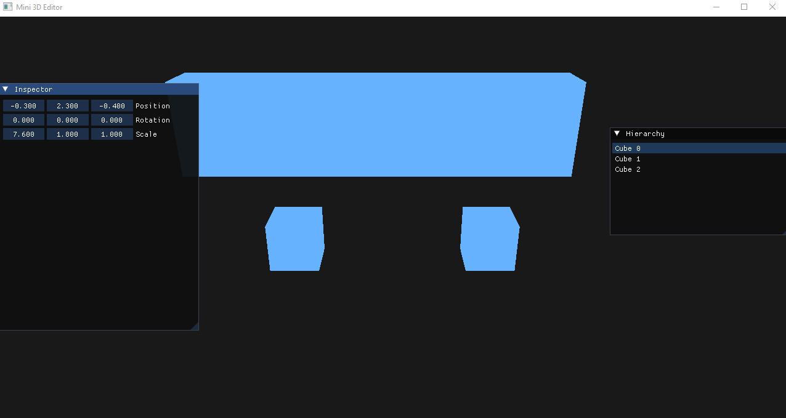

This Project is a **simple** example of a 3d render system and object  transform  basic , It helps your learn the fundimental of a 3D  engine 
You can compile the source code directly;

# # using 
- IMGUI - FOR TABLES like inespecter
- glad and etc.. for OpenGl  render system

You can Also contribute to this project feel free to open a pull request or issue  at this repo

screenshot
